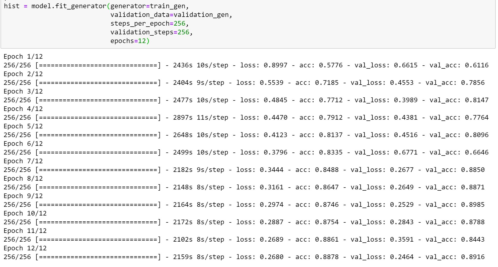
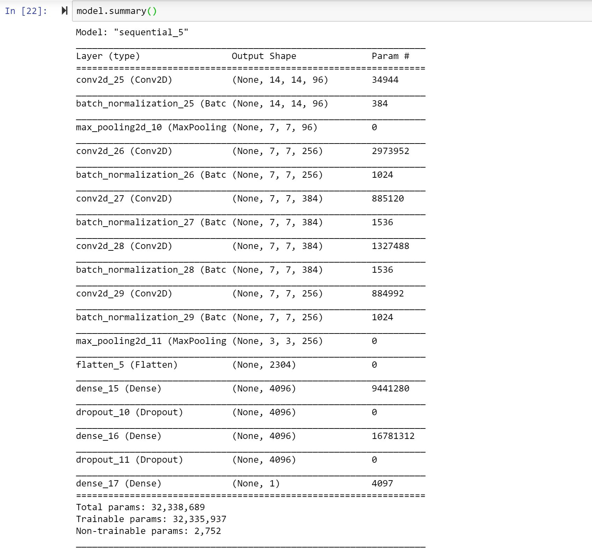
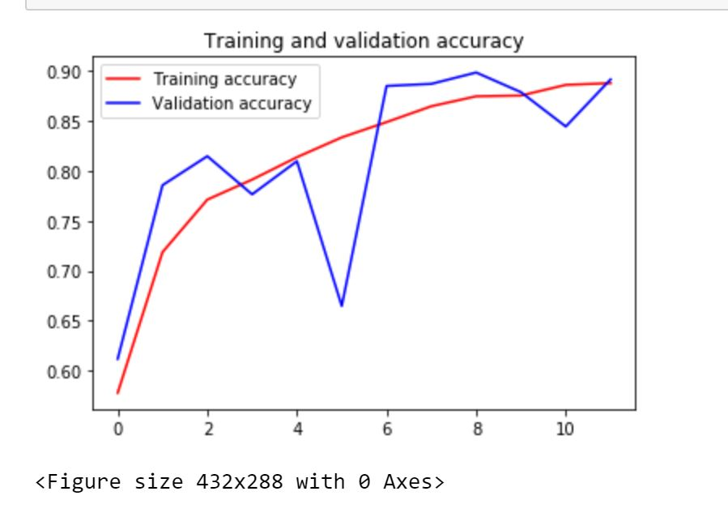
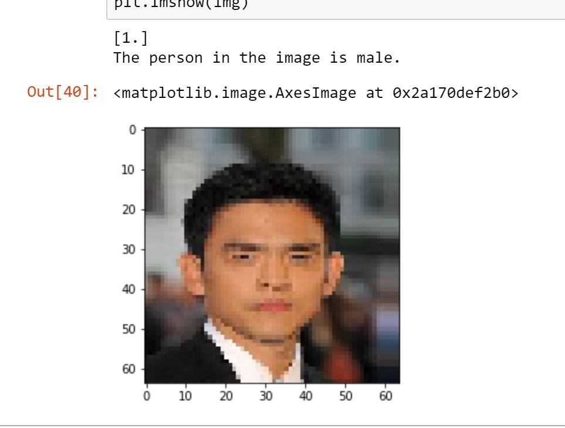
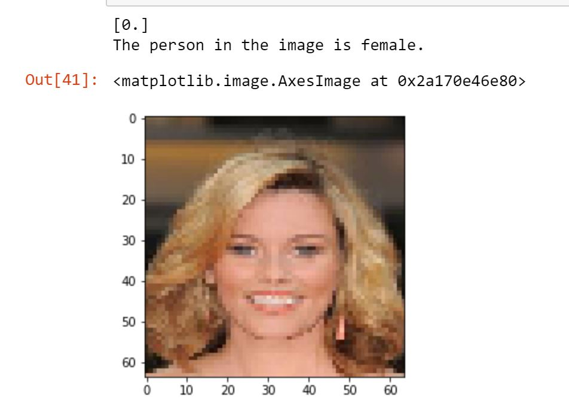

# gender-classification-image
Classifying an image whether it's male or female using Kaggle dataset.  
The dataset contains more than 200k images split into Train, Test & Validation Sets.  
The model contains 5 CNN layers with relu activation function and sigmoid activation function for the last Dense layer to narrow down the probabilities for our binary classification.  
Optimizer used : Adam, loss : binary crossentropy, learning rate : 0.001, epochs : 12, steps per epoch : 256  
The Training Result: 
  
The Model Summary: 
  
Training and Validation Accuracy: 
  
Testing the model: 
  

